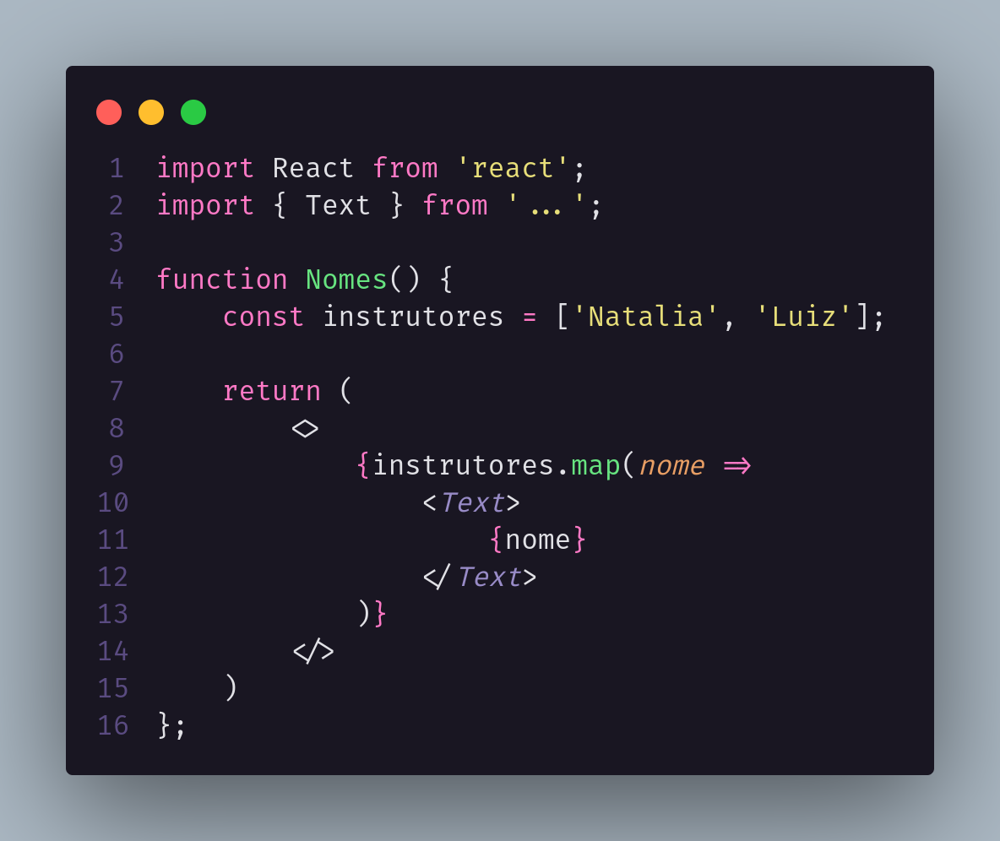
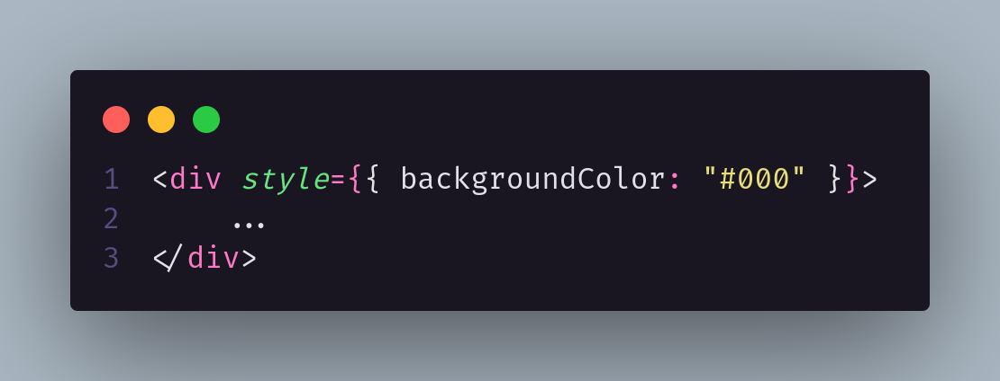
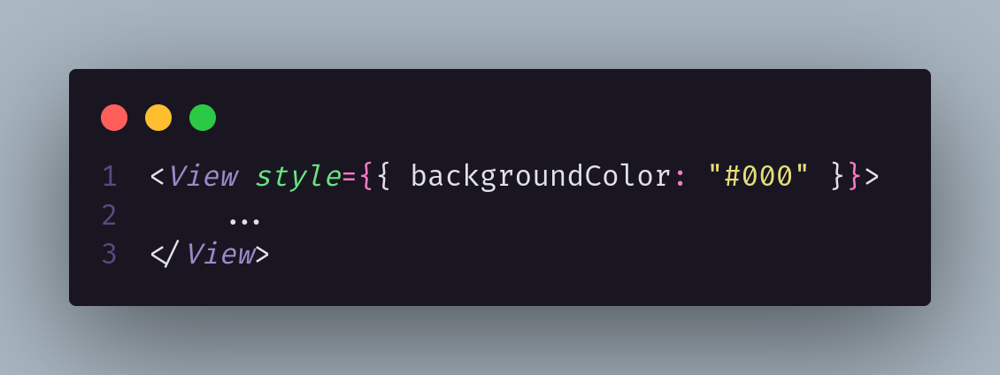
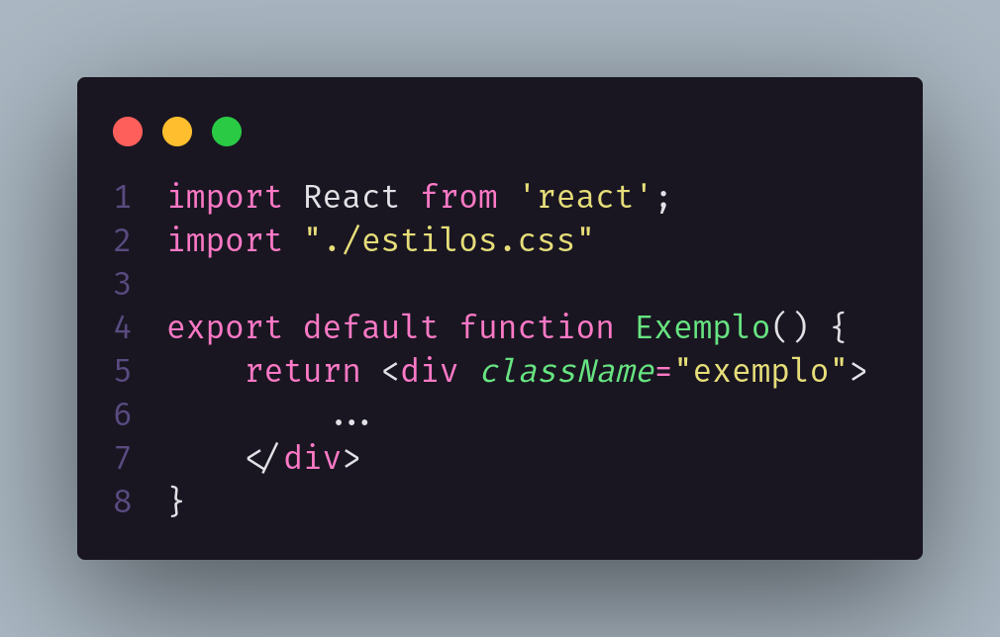
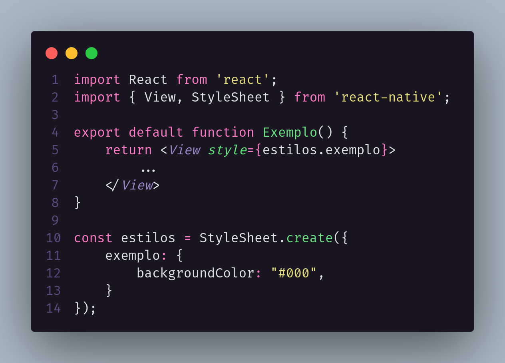
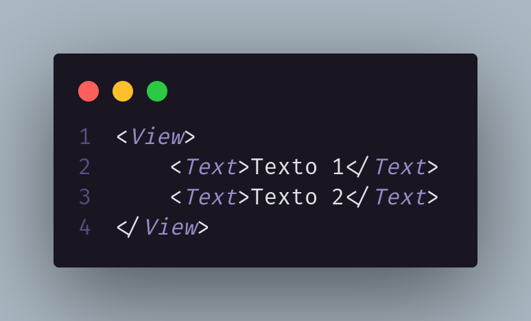
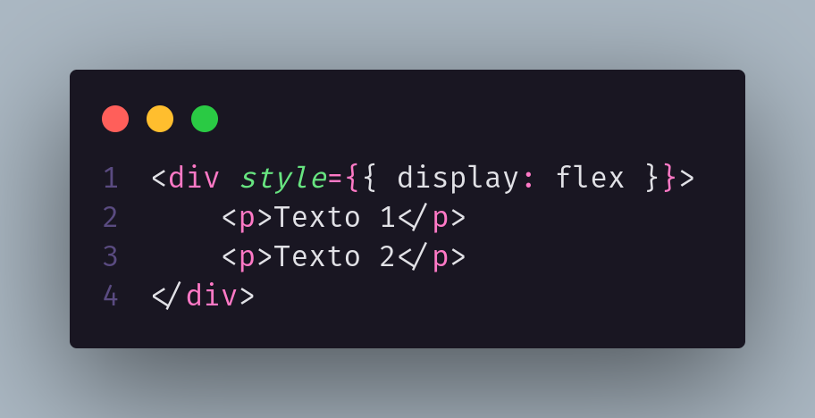
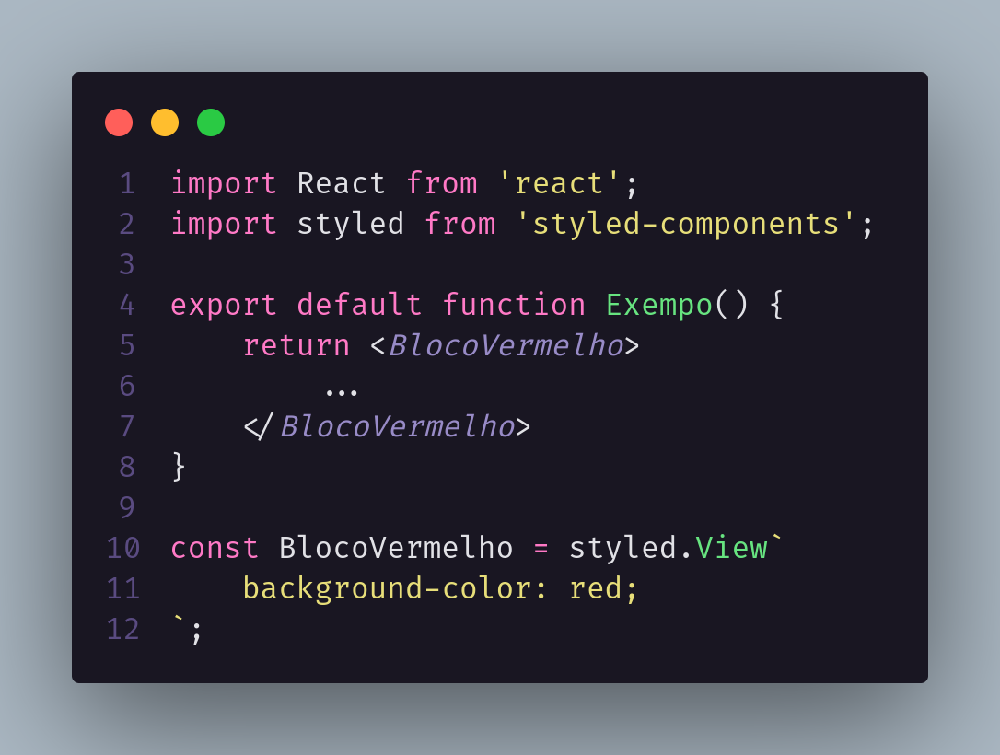
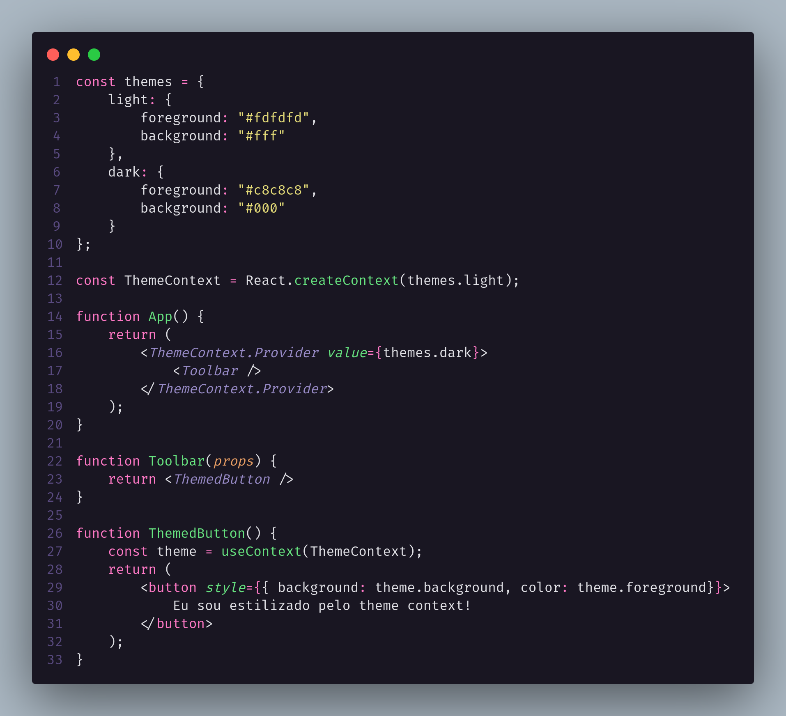

# **Diferença entre `React JS` e `React Native`**

### Com o crescimento da utilização de dispositivos mobile o facebook viu a necessidade de criar aplicações hibridas que mantivessem a performance de aplicativos nativos do Android e IOS. Então utilizando o React como base o facebook criou uma estrutura que transforma o mesmo código em código nativo Android e IOS. E assim surgiu o React Native em 2015.

#

# **Componentes, Javascript e JSX**

## **`React JS`**

## **`React Native(JSX)`**

### Em JSX Não é possível usar tags DOM como: `
, 
, <h1>...`. No lugar da `
` usamos `View` e no lugar de `
, <h1>...` usamos `<Text>`

#

# **Estilos Inline**

### Mesma estrutura para estilização inline para os dois só alterando a forma de declarar, sendo no React JS possível o uso da tag `
` e no React Native é necessário o uso da tag `<View>`

## **`React JS`**

## **`React Native`**

#

# **Estilos exportados**

## **`React JS`**

### Utiliza `className`

## **`React Native`**

### React Native não faz uso de css, então é preciso criar uma estrutura usando variaveis que recebem o `StyleSheet`

#
# **Flex Box**

### No React Native nos temos o FLex Box como padrão nos estilos, não assim não sendo preciso declarar que o display é `flex`. E o flex-direction já vem sendo com column 

## **`React Native`**

### **Flex-direction padrão column**

## **`React JS`**

### **Flex-direction padrão row**

#
# **Bibliotecas**

### As bibliotecas que não utilizando recursos nativos e nem o DOM é possível usar tanto em React quanto no React Native. Se tiver coisas que utilizam recursos nativos ou o DOM já existe duas bibliotecas desenvolvidas, uma para React e outra pra React Native. 

### Nos `styled-components` tem o msm nome de biblioteca, é basicamnete o mesmo pacote que exportamos, tanto para versão de React quanto pra Native, mas ele foi feito separadamente para cada um. Mesmo dando a impressão de que seja a msm coisa

### **`styled-components`**

### Essa Biblioteca possui algumas limitações especifiacamente no React Native, pois não tento o CSS como base e sim uma conversão para CSS, com isso não é possível fazer animações que são nativas do CSS, assim como não é possível ter media query, sendo necessario usar outra biblioteca que não seja a `styled-components`

#
# **Controle de Estados**

### Não existe muita diferença entre React e React Native, pq todas ou a maioria das soluções que se encontra no mercado, não se precisa utilizar nada do DOM para conseguir fazer o gerenciamento, e sim apenas Dados

**`React Context`**

